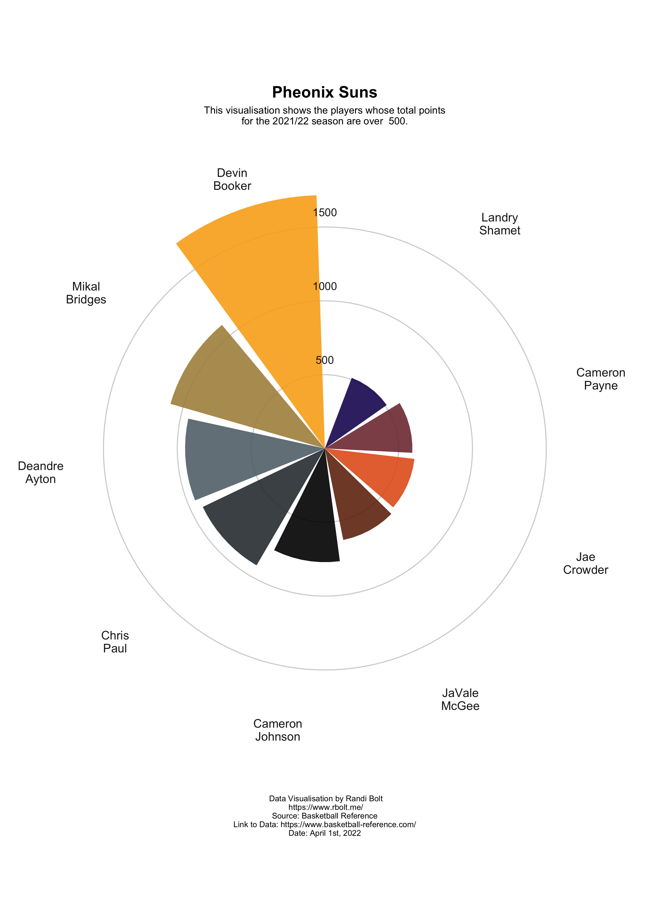
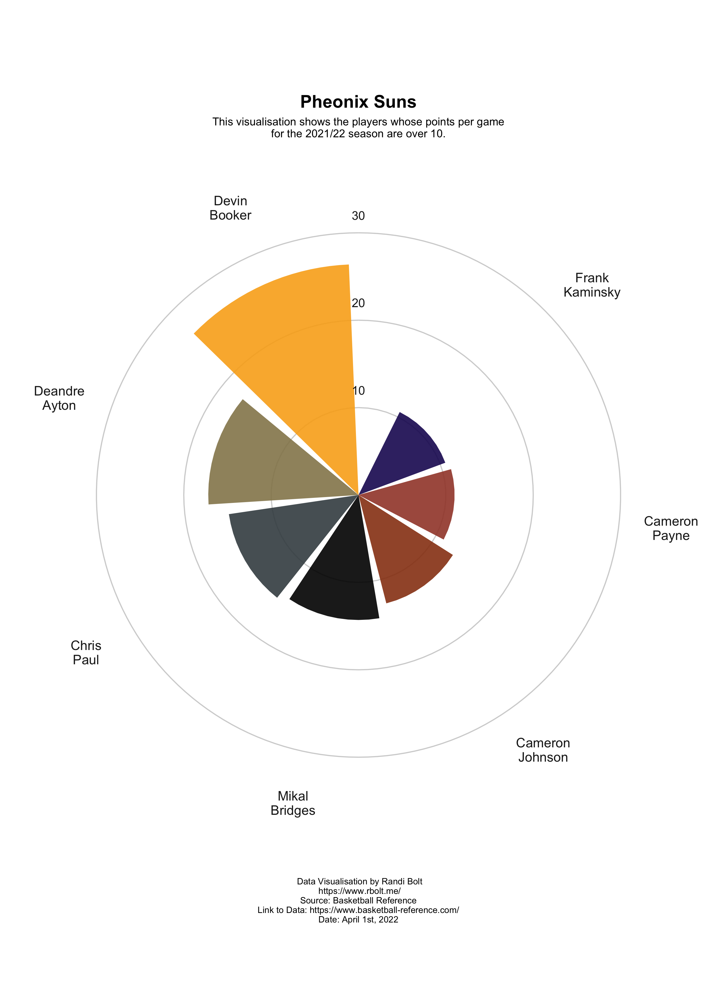
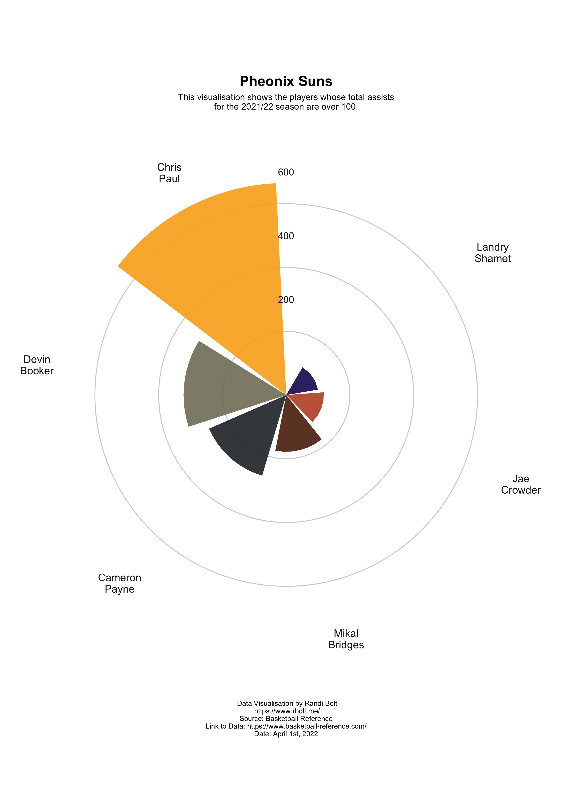
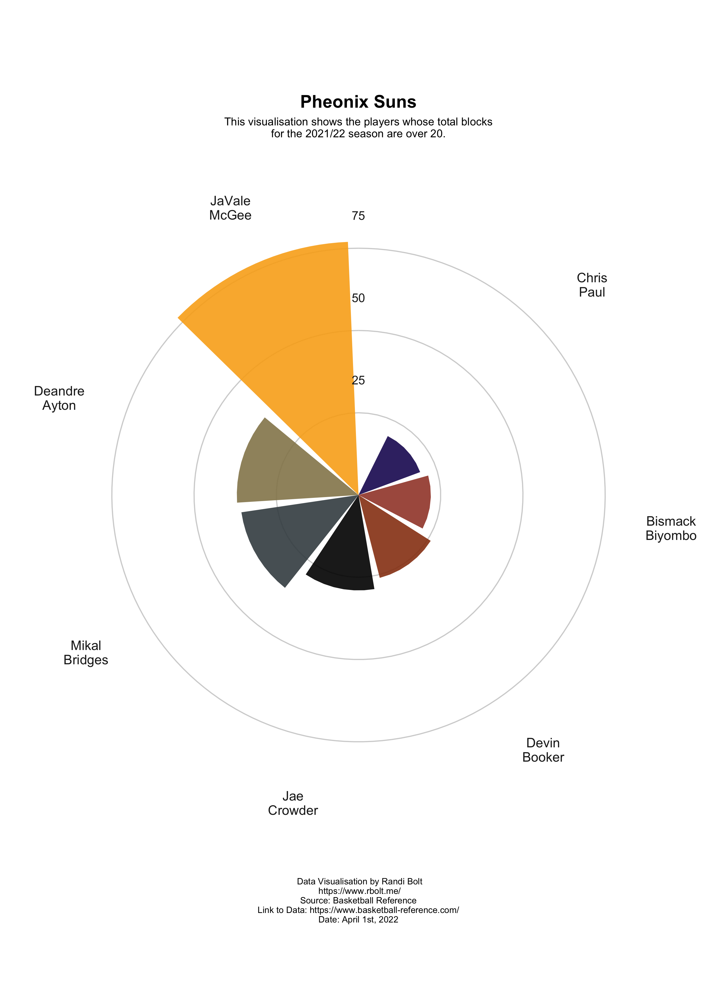

```{r setup, include=FALSE}
knitr::opts_chunk$set(error=FALSE,
                      message= FALSE,
                      warning=FALSE)
```

# Load Packages

```{r}
library(rvest) 
library(tidyverse) 
library(reactable)
library(plotly)
```

# Load and Prepare Data Function 

```{r}
# Calls and merges team total stats and per game stats.  
merge_stats_table <- function(team_name, 
                              slug) {
  
  # define team page URL
  url <- paste0("https://www.basketball-reference.com/teams/",slug,"/2022.html")
  
  # Read total stats
  ttl_stat <- url %>%
  read_html %>%
  html_node("#totals") %>% 
  html_table()
  
  # Read Per Game stats
  per_game_stat <- url %>%
  read_html %>%
  html_node("#per_game") %>% 
  html_table()
  
  # Rename Column 2 to Name 
  names(ttl_stat)[2] <- "Name"
  names(per_game_stat)[2] <- "Name"
  
  # Merge stats tables 
  merge(ttl_stat, per_game_stat, 
        by = c("Age", "Name", "G", "GS"))
  
}
```

# Load and Prepare Data

```{r}
# Suns Data 
suns_tt <- merge_stats_table("Phoenix Suns","PHO")
```

# Create PTS Data  

```{r}
# Sort and filter data by PTS >= a value (500)
pts_sort <- function(data_tt, value){
  # Arrange by most PTS, and filter pts >= value
  data_tt %>%
  filter(PTS >= value)
}

# Sort Data 
suns_tt_pts_sort <- pts_sort(suns_tt, 500)

# Create PTS Data Frames
suns_pts <- data.frame(
  player = suns_tt_pts_sort$Name,
  pts = suns_tt_pts_sort$PTS
) 
```

# PTS per Game Data 

```{r}
# Sort and filter data by PTS/G >= a value (10)
pts_pg_sort <- function(data_tt, value){
  # Arrange by most overall AST (.x), and filter pts >= value
  data_tt %>%
  filter(`PTS/G` >= value)
}

# Sort Data 
suns_pg_pts_sort <- pts_pg_sort(suns_tt, 10.0)

# Create PTS Data Frames
suns_pts_pg <- data.frame(
  player = suns_pg_pts_sort$Name,
  pts_pg = suns_pg_pts_sort$`PTS/G`
) 
```

# AST Data 

```{r}
# Sort and filter data by AST >= a value (100)
ast_sort <- function(data_tt, value){
  # Arrange by most overall AST (.x), and filter pts >= value
  data_tt %>%
  filter(AST.x >= value)
}

# Sort Data 
suns_tt_ast_sort <- ast_sort(suns_tt, 100)

# Create AST Data Frames
suns_ast <- data.frame(
  player = suns_tt_ast_sort$Name,
  ast = suns_tt_ast_sort$AST.x
) 
```

# BLK Data 

```{r}
# Sort and filter data by BLK >= a value (20)
blk_sort <- function(data_tt, value){
  # Arrange by most overall AST (.x), and filter pts >= value
  data_tt %>%
  filter(BLK.x >= value)
}

# Sort Data 
suns_tt_blk_sort <- blk_sort(suns_tt, 20)

# Create BLK Data Frames
suns_blk <- data.frame(
  player = suns_tt_blk_sort$Name,
  blk = suns_tt_blk_sort$BLK.x
)
```

# Create Color Palettes

```{r}
# Suns 
suns_cols <- c("#1D1160", "#E56020", "#000000", "#63727A", "#F9AD1B")
```

```{r}
# PTS Data Lengths 
suns_pts_size <- length(suns_pts$player)
# PTS per Game Data Lengths 
suns_pts_pg_size <- length(suns_pts_pg$player)
# AST Data Lengths
suns_ast_size <- length(suns_ast$player)
# BLK Data Lengths
suns_blk_size <- length(suns_blk$player)
```

```{r}
# PTS Color Palettes
suns_pts_cols <- colorRampPalette(suns_cols)(suns_pts_size)
# PTS per Game Color Palettes
suns_pts_pg_cols <- colorRampPalette(suns_cols)(suns_pts_pg_size)
# AST Color Palettes
suns_ast_cols <- colorRampPalette(suns_cols)(suns_ast_size)
# BLK Color Palettes
suns_blk_cols <- colorRampPalette(suns_cols)(suns_blk_size)
```

# PTS Radar plot function 

```{r}
# Pts radar plot function 
pts_radar_plot <- function(data_stat, team_cols, team_title){
  ggplot(data_stat, 
         aes(x = reorder(str_wrap(player,5), pts),
             y = pts)
         ) + 
    # Make Custome panel Grid 
    geom_hline(
      aes(yintercept =y),
      data.frame(y=c(0:3)*500),
      color = "lightgrey"
    ) + 
    geom_col(
      show.legend = TRUE,
      fill = team_cols,
      position = "dodge2",
      alpha = 0.9
    ) +
    # Annotate custom scale inside plot
    annotate(
    x = 0, 
    y = 600, 
    label = "500", 
    geom = "text", 
    color = "gray12"
  ) +
  annotate(
    x = 0, 
    y = 1100, 
    label = "1000", 
    geom = "text", 
    color = "gray12"
  ) +
  annotate(
    x = 0, 
    y = 1600, 
    label = "1500", 
    geom = "text", 
    color = "gray12"
  ) +
    theme(
    # Remove axis ticks and text
    axis.title = element_blank(),
    axis.ticks = element_blank(),
    axis.text.y = element_blank(),
    
    # Use gray text for the region names
    axis.text.x = element_text(color = "gray12", size = 12),
    
    # Remove legend
    legend.position = "none",
    
    # Customize the text in the title, subtitle, and caption
    plot.title = element_text(face = "bold", size = 16, hjust = 0.5),
    plot.subtitle = element_text(size = 10, hjust = .5),
    plot.caption = element_text(size = 8, hjust = .5),
    
    # Make the background white and remove extra grid lines
    panel.background = element_rect(fill = "white", color = "white"),
    panel.grid = element_blank(),
    panel.grid.major.x = element_blank()
  ) + 
    labs(
      title = team_title,
      subtitle = paste(
        "This visualisation shows the players whose total points", 
        "for the 2021/22 season are over  500.",
        sep = "\n"
      ),
      caption = "\n\n Data Visualisation by Randi Bolt\n https://www.rbolt.me/\nSource: Basketball Reference\nLink to Data: https://www.basketball-reference.com/\nDate: April 1st, 2022"
    ) +
    coord_polar()
}
```

# PTS per Game Radar Function 

```{r}
# Pts per game radar function
pts_pg_radar_plot <- function(data_stat, team_cols, team_title){
  ggplot(data_stat, 
         aes(x = reorder(str_wrap(player,5), pts_pg),
             y = pts_pg)
         ) + 
    # Make Custome panel Grid 
    geom_hline(
      aes(yintercept =y),
      data.frame(y=c(0:3)*10),
      color = "lightgrey"
    ) + 
    geom_col(
      show.legend = TRUE,
      fill = team_cols,
      position = "dodge2",
      alpha = 0.9
    ) +
    # Annotate custom scale inside plot
    annotate(
    x = 0, 
    y = 12, 
    label = "10", 
    geom = "text", 
    color = "gray12"
  ) +
  annotate(
    x = 0, 
    y = 22, 
    label = "20", 
    geom = "text", 
    color = "gray12"
  ) +
  annotate(
    x = 0, 
    y = 32, 
    label = "30", 
    geom = "text", 
    color = "gray12"
  ) +
    theme(
    # Remove axis ticks and text
    axis.title = element_blank(),
    axis.ticks = element_blank(),
    axis.text.y = element_blank(),
    
    # Use gray text for the region names
    axis.text.x = element_text(color = "gray12", size = 12),
    
    # Remove legend
    legend.position = "none",
    
    # Customize the text in the title, subtitle, and caption
    plot.title = element_text(face = "bold", size = 16, hjust = 0.5),
    plot.subtitle = element_text(size = 10, hjust = .5),
    plot.caption = element_text(size = 8, hjust = .5),
    
    # Make the background white and remove extra grid lines
    panel.background = element_rect(fill = "white", color = "white"),
    panel.grid = element_blank(),
    panel.grid.major.x = element_blank()
  ) + 
    labs(
      title = team_title,
      subtitle = paste(
        "This visualisation shows the players whose points per game", 
        "for the 2021/22 season are over 10.",
        sep = "\n"
      ),
      caption = "\n\n Data Visualisation by Randi Bolt\n https://www.rbolt.me/\nSource: Basketball Reference\nLink to Data: https://www.basketball-reference.com/\nDate: April 1st, 2022"
    ) +
    coord_polar()
}
```

# AST Radar Plot Function 

```{r}
# AST radar plot function 
ast_radar_plot <- function(data_stat, team_cols, team_title){
  ggplot(data_stat, 
         aes(x = reorder(str_wrap(player,5), ast),
             y = ast)
         ) + 
    # Make Custome panel Grid 
    geom_hline(
      aes(yintercept =y),
      data.frame(y=c(0:3)*200),
      color = "lightgrey"
    ) + 
    geom_col(
      show.legend = TRUE,
      fill = team_cols,
      position = "dodge2",
      alpha = 0.9
    ) +
    # Annotate custom scale inside plot
    annotate(
    x = 0, 
    y = 300, 
    label = "200", 
    geom = "text", 
    color = "gray12"
  ) +
  annotate(
    x = 0, 
    y = 500, 
    label = "400", 
    geom = "text", 
    color = "gray12"
  ) +
  annotate(
    x = 0, 
    y = 700, 
    label = "600", 
    geom = "text", 
    color = "gray12"
  ) +
    theme(
    # Remove axis ticks and text
    axis.title = element_blank(),
    axis.ticks = element_blank(),
    axis.text.y = element_blank(),
    
    # Use gray text for the region names
    axis.text.x = element_text(color = "gray12", size = 12),
    
    # Remove legend
    legend.position = "none",
    
    # Customize the text in the title, subtitle, and caption
    plot.title = element_text(face = "bold", size = 16, hjust = 0.5),
    plot.subtitle = element_text(size = 10, hjust = .5),
    plot.caption = element_text(size = 8, hjust = .5),
    
    # Make the background white and remove extra grid lines
    panel.background = element_rect(fill = "white", color = "white"),
    panel.grid = element_blank(),
    panel.grid.major.x = element_blank()
  ) + 
    labs(
      title = team_title,
      subtitle = paste(
        "This visualisation shows the players whose total assists", 
        "for the 2021/22 season are over 100.",
        sep = "\n"
      ),
      caption = "\n\n Data Visualisation by Randi Bolt\n https://www.rbolt.me/\nSource: Basketball Reference\nLink to Data: https://www.basketball-reference.com/\nDate: April 1st, 2022"
    ) +
    coord_polar()
}
```

# BLK Radar Plot Function 

```{r}
# BLK radar plot function 
blk_radar_plot <- function(data_stat, team_cols, team_title){
  ggplot(data_stat, 
         aes(x = reorder(str_wrap(player,5), blk),
             y = blk)
         ) + 
    # Make Custome panel Grid 
    geom_hline(
      aes(yintercept =y),
      data.frame(y=c(0:3)*25),
      color = "lightgrey"
    ) + 
    geom_col(
      show.legend = TRUE,
      fill = team_cols,
      position = "dodge2",
      alpha = 0.9
    ) +
    # Annotate custom scale inside plot
    annotate(
    x = 0, 
    y = 35, 
    label = "25", 
    geom = "text", 
    color = "gray12"
  ) +
  annotate(
    x = 0, 
    y = 60, 
    label = "50", 
    geom = "text", 
    color = "gray12"
  ) +
  annotate(
    x = 0, 
    y = 85, 
    label = "75", 
    geom = "text", 
    color = "gray12"
  ) +
    theme(
    # Remove axis ticks and text
    axis.title = element_blank(),
    axis.ticks = element_blank(),
    axis.text.y = element_blank(),
    
    # Use gray text for the region names
    axis.text.x = element_text(color = "gray12", size = 12),
    
    # Remove legend
    legend.position = "none",
    
    # Customize the text in the title, subtitle, and caption
    plot.title = element_text(face = "bold", size = 16, hjust = 0.5),
    plot.subtitle = element_text(size = 10, hjust = .5),
    plot.caption = element_text(size = 8, hjust = .5),
    
    # Make the background white and remove extra grid lines
    panel.background = element_rect(fill = "white", color = "white"),
    panel.grid = element_blank(),
    panel.grid.major.x = element_blank()
  ) + 
    labs(
      title = team_title,
      subtitle = paste(
        "This visualisation shows the players whose total blocks", 
        "for the 2021/22 season are over 20.",
        sep = "\n"
      ),
      caption = "\n\n Data Visualisation by Randi Bolt\n https://www.rbolt.me/\nSource: Basketball Reference\nLink to Data: https://www.basketball-reference.com/\nDate: April 1st, 2022"
    ) +
    coord_polar()
}
```

# Radar Plots

```{r}
# PTS
suns_pts_radar <- pts_radar_plot(suns_pts, suns_pts_cols, "\nPheonix Suns")
# Pts/g
suns_pts_pg_radar <- pts_pg_radar_plot(suns_pts_pg, suns_pts_pg_cols, "\nPheonix Suns")
# Ast
suns_ast_radar <- ast_radar_plot(suns_ast, suns_ast_cols, "\nPheonix Suns")
# BLK 
suns_blk_radar <- blk_radar_plot(suns_blk, suns_blk_cols, "\nPheonix Suns")
# Save Data 
ggsave("suns_pts_radar.png", suns_pts_radar ,width=9 , height=12.6)
ggsave("suns_pts_pg_radar.png", suns_pts_pg_radar ,width=9 , height=12.6)
ggsave("suns_ast_radar.png", suns_ast_radar ,width=9 , height=12.6)
ggsave("suns_blk_radar.png", suns_blk_radar ,width=9 , height=12.6)
# Print Data 




```


