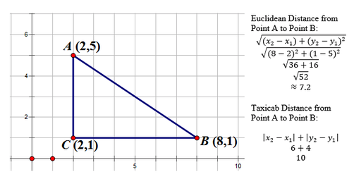

# Introduction 

In this post I will be walking through the steps I used to create a package with R Studio. All my resources are linked below. 

# Background 

The package I am planning to make is a distance package that will have variations of two functions. One function will calculate the Euclidean distance [(Read more here)](https://www.cuemath.com/euclidean-distance-formula/), and the other will calculate the Taxicab distance [(Read more here)](https://mat292project.weebly.com/distance-in-taxi-cab.html). Below **Figure 1** (from the Taxicab distance link) shows both the Euclidean and Taxicab calculations for $\overline{AB}$ of $\triangle ABC$.

```{r, echo = F, out.width = "80%", fig.align='center', fig.cap='Distance from A to B on a traingle in Euclidean Distance and Taxicab Distance'}

```

Using this example, my distance package should be able to preform the following code. 

```{r}
### Euclidean Distance 
distance_E <- function(x1,x2,y1,y2){
  sqrt((x2-x1)^2+(y2-y1)^2)
}
### Taxicab Distance
distance_T <- function(x1,x2,y1,y2){
  abs(x2-x1)+abs(y2-y1)
}
### Example 
x1 <- 2
x2 <- 8
y1 <- 5
y2 <- 1
distance_E(x1,x2,y1,y2)
distance_T(x1,x2,y1,y2)
```

Dang, that is pretty tedious entering in each point like that. Not sure how much time that will save us in the long run so lets create a couple more functions. That way we can put in A and B as points instead. 

```{r}
### Euclidean xy Distance 
distance_Eab <- function(A,B){
  sqrt((B[1]-A[1])^2+(B[2]-A[2])^2)
}
### Taxicab xy Distance
distance_Tab <- function(A,B){
  abs(B[1]-A[1])+abs(B[2]-A[2])
}
### Example 
A <- c(2,5)
B <- c(8,1)
distance_Eab(A,B)
distance_Tab(A,B)
```

Lastly, just because, lets create two more functions where we can put in a single line. 

```{r}
### Euclidean xy Distance 
distance_Eline <- function(line){
  sqrt((line[3]-line[1])^2+(line[4]-line[2])^2)
}
### Taxicab xy Distance
distance_Tline <- function(line){
  abs(line[3]-line[1])+abs(line[4]-line[2])
}
### Example
line <- c(A,B)
distance_Eline(line)
distance_Tline(line)
```

Alrighty, now let's jump into building this package. 

# Create the GitHub Repository 

Next create a GitHub Repository, but do not initialize anything withing the repository. See **Figure 2** below. 

```{r, echo = F, out.width = "80%", fig.align='center', fig.cap='How the create a new repository page will look before you create it.'}
knitr::include_graphics("img/img2.png")
```

After hitting the create button copy the github link and copy that into your RStudio when creating a new project with Version Control. 

Note that there are other ways to do this step, but this is what I have found causes me the least amount of problems. 

# Create the Package

Now the fun part. 

In the console call `library(usethis)` and `library(devtools)`.

Then lets create our package with `create_package("../distance")`. See **Figure 3** below to compare. 

```{r, echo = F, out.width = "80%", fig.align='center', fig.cap='img3'}
knitr::include_graphics("img/img3.png")
```

Remember:

- `""` around file name 

- `../` to leave folder, otherwise you will create a distance folder within your distance folder. 

# First Commit

Now that you've created a new package, a new R Studio should have opened up. That mean you probably need to load in `library(usethis)` and `library(devtools)` into the console again. Next you can use the Git features that are built into RStudio or `use_git()` like Hadley Wickham does in his book [R Packages](https://r-pkgs.org/index.html). Note that you might still need to manually hit the push button (green up arrow) if you do not see your commits in GitHub. 

# Write the first function 

Now into the console create the example points in the first four example values, the distance_E() function, and then verify that is works. 

img?

From here `use_r("distance_E")` should create the .R file in the R folder. Then use `load_all()` to quickly make this function available to us. 

img?

Now might be a good time to push another commit. 

# Edit Description 

At this point it might also be a good time to run the `check()` function in the console which should report something like whats in **Figure ?** below. 

img ?

What that warding is telling us is that we do not have a license for our package, which means it's a good time to edit the description. Open up the DESCRIPTION file in the distance project folder and start editing. For the license you can type `use_mit_license()` into the console and it will automatically change your description. See **Figure ?** below for what cosole should look like. 

img?

Change the rest of the description manually. For example see what I have written below: 

img?

# document() and install()

Now back in the distance_E.R file create the documentation for the function, and save. 

img?

Then in the console type `document()` and then `?distance_E()` to verify that it worked. 

img?

Push to github again, and `check()` again. 

img?

Next `install()` into the console, and verify that you can load and use your library. 

# Create Tests

Now in the console type in `use_testthat()` and then `use_test("distance_E")` like in **Fig. ?** below. 

img?

A test-distance_E.R file should have appeard in a tests folder in the distance project. I do not have a lot of experience writing tests so for now there I will start with only 1 test to verify that the function works. 

img?

To check that use `test()` 

img? 

Now just to document(), load_all(), and push another commit. 

img? 

# Rinse Repeat

Before creating a ReadMe, I want to add the other five functions of this package. I will not show each of those steps again, but you can view the completed repository here. 

# Create ReadMe

This next part is pretty neat. To create a readme, type into the console `use_readme_rmd()`. Mine looks like this:

img?

Then to change .Rmd to a .md use `build_readme()` in the console


# Final Push and Test

Push again and the end. 

```{r}
# install.packages("devtools")
devtools::install_github("rbolt13/distance")
library(distance)
distance_E(0,4,3,0)
distance_T(0,4,3,0)
```


# Sources 

[R Packages](https://r-pkgs.org/index.html)

[Taxicab Geometry](https://mat292project.weebly.com/distance-in-taxi-cab.html)


