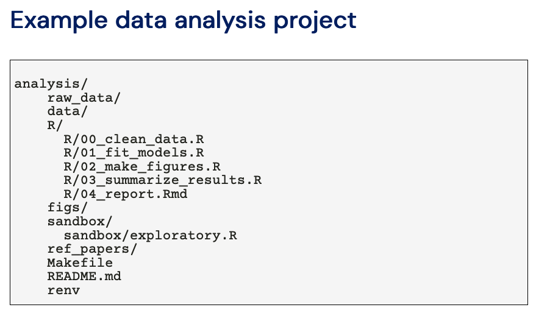
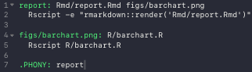
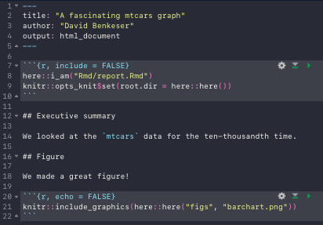
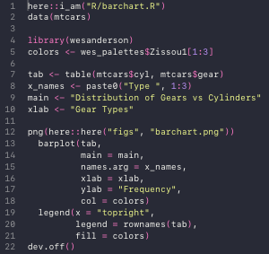
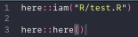
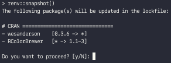

These are my notes on Project Organization from [Data Science Toolkit](https://benkeser.github.io/info550/), by David Benkeser. 

[Video](https://benkeser.github.io/info550/recordings/project-organization) | [Notes](https://benkeser.github.io/info550/lectures/08_organization/organization.html#1) | [Github](https://github.com/benkeser/info550)

# Part 1 (0:00 - 36:54)

## Pre-lecture Questions

### How to add headings?

In R chunk use code options : `fig.cap="**Figure Caption**"`

```{r, fig.cap="**Figure Caption**"}
barplot(c(1,2,3,4))
```

Another option would be to have the first row of your table be your title and then format so the first row doesn't have any line filler in it. 

[Stackoverflow](https://stackoverflow.com/questions/33710240/how-to-attach-a-title-to-a-data-frame-in-r)

```{r}
report <- list()
report[[1]] <- "Report Name"
report[[2]] <- head(mtcars)
report
```


Your goal is to minimize time as much as possible. 

Don't spend a lot of time formatting your tables until they are going to be final. 

### What is `::` in R? 

A better way of referencing functions from a particular package. 

For example: `bookdown::htmldoc2` means that in that in the bookdown package there is a function htmldoc2. That way if multiple functions from different packages have the same name, now your code knows which package to call it from.

This is less ambiguous. 

# Lecture 

## Basic Principles 

### Use git 

* <span style="color: red;">**Put everything in one version-controlled directory.**</span>
* Jenny Bryan talks about [Project Oriented Workflow](https://rstats.wtf/project-oriented-workflow.html)
   
     [Website](https://jennybryan.org/) |  [Twitter](https://twitter.com/JennyBryan?ref_src=twsrc%5Egoogle%7Ctwcamp%5Eserp%7Ctwgr%5Eauthor) | [GitHub](https://github.com/jennybc)
* Everything related to one project lives in one folder on you computer. 
* Don't spread things out across multiple folders. 
* Put project directory on version control, and that's going to be your git repository. 


### Develop your own system

* Be Consistent, but look for ways to improve. 
    * Naming conventions, file structure, make strucure 
    
### Data

* Raw data is sacred and kept seperate from everything else. 
* Separate code and data
* Use make files and/ or READMEs to document dependencies

### Names

* No spaces in file names
* use meaningful file names
* use YY-MM-DD date formatting 
    * this sorts you data (ex: most recent)properly

### Code

* Modularize R code. 
* Know where to go to make changes. 
* <span style="color: red;">**No absolute paths.**</span> 
* <span style="color: red;">**Use a package management system**</span>

## What to organize? 

It is probably useful to have a system for organizing:

* data analysis projects;
* first-author papers;
* talks.

<span style="color: red;">**Think about organization of a project from the outset!**</span>

## Collaborative Projects

* Google drive 
* [Overleaf](https://www.overleaf.com/)

Some advice: 

* Address organization from the outset.
* Ideally, bring people on board to your (version controlled, reproducible) system.
* Keep open lines of communication (especially if using GitHub)

Even if some elements of the project are outside your control, you can try to bring in elements to your workflow. 

* E.g., if you receive comments with tracked changes from a colleague, incorporate them into the document, add a commit message describing who's edits they were.

If working on a shared GitHub repo, keep open lines of communication, e.g., short emails (or [slack](https://slack.com/) messages, etc...), "Just pushed `x`..."



* raw data is sacred 
* clean data will be saved into the data folder
* serperate scripts out by language or have a code directory 
* numbering equations will give an indicator in what order the code runs. 
* sandbox directory for exploratory data analysis that no one really needs to see. 
* Makefile 
* renv is a way to manage R package 

Note: To go back two levels in your file directory: `./../../`

## Organizing Data 

* Dont be tempted to edit raw data by hand
* Everything scripted 
* Let collaborators know: "Don't color code things." 
* Ask for a moc data set ahead of time so you know their form ahead of time to talk about raw data formatting ahead of time. 

Use meta-data files to describe raw and cleaned data. 

* structure as data (e.g. .csv so easy to read)


[Tidy Data by Hadley Wickham](https://www.jstatsoft.org/article/view/v059i10)

* Worth the read
* Each Varibale forms a column
* Each observation forms a row
* Each observation unit forms a table. 

## Exploring data 

One of the first things we'll often do is open the data and start poking around.

* Could be informal, "getting to know you."
* Could be more formal, "see if anything looks interesting."

This is often done in an ad-hoc way:

* entering commands directly into R;
* making and saving plots "by hand"; 
* etc...

**Slow down and document**

* Your future self will thank you
* even if it is just in a google doc to yourself. 

You want to avoid situations like:

* need to recreate a plot that you made "by hand" and saved "by hand";
* figuring out why you removed certain observations;
* trying to remember what variables had an interesting relationship that you wanted to follow up on later.

Write out a set of comments describing what you are try to accomplish and fill in code from there. 

* I do this for every coding project.
  * Data analysis, methods coding, package development

Leave a search-able comment tag by code to return to later

* I use e.g., `# TO DO: add math expression to labels; make colors prettier`.

Sets "the bones" of a formal analysis in place while allowing for some creative flow.

From the outset, stop and think about what you want to do. Start filling in details from there. That simple approach will increase efficiency and reproducibility.

Other helpful ideas for formalizing exploratory data analysis:

* `.Rhistory` files
  * all the commands used in an R session
* Informal `.Rmd` documents. 
  * easy way to organize code/comments into readable format
* `save` intermediate objects and workspaces
  * and document what they contain! 
* `knitr::spin` 
  * writing `.R` scripts with rendered-able comments 
* [Juypyter Notebook](https://jupyter.org/)

### The here package

**No absolute paths**

* Absolute paths are the enemy of project reproducibility.

For `R` projects, the [`here`](https://here.r-lib.org/) package provides a simple way to use relative file paths.

* Read [Jenny Bryan and James Hester's chapter](https://rstats.wtf/project-oriented-workflow.html) on project-oriented work-flows.

The use of `here` is dead-simple and best illustrated by example.


Root directory is `my_project`

* this is where `.git` lives
* all file paths should be relative to this

Each `R` script or `Rmd` report, should contain a call to `here::i_am('path/to/this/file')` at the top

* `here::i_am` means use function `i_am` from `here`

For example: 

```{r}
# include at the top of script
here::i_am('R/my_analysis.R')
# now add all your R code 
```

Now anytime you make analysis you can use the here function. 

```{r}
# include at the top of script
here::i_am('index.en.Rmd')

# load data 
my_data <- read.csv(here::here('data','my_data.csv'))

# do some analysis to get results
my_results <- sum(my_data)

# save results
save(my_results, file = here::here('output', 'my_results.RData'))
```

# Part 2 (39:40 - 1:31:20)

Open Example Project in [Sublime](https://www.sublimetext.com/)

## Example Code 

To begin look at the `Makefile`



The analysis here is going to culminate in a <span style="color: green;">report</span>, so we have a rule to make a <span style="color: green;">report</span> which says to render the report.Rmd document that lives in the Rmd folder. 

We can see the rule for making our report has a prerequisite. It depends on the source code (rmd shown below) and the barchart.png figure in fig folder. 

The rule for making that chart is shown on line 4: <span style="color: green;">figs/barchart.png</span>, which depends on the barchart.R code in the R directory. 



This report is saying that we looked at some data and make a figure which lives in the "figs" folder and is called "barchart.png". 



This is making a barchart out of the mtcars data. 

In the terminal now run `make report`, then open the report by typing `open Rmd/report.html`. 

## Here package (Two examples)

Identity where the folder is in relation to the project root. 

In the R folder create an R file `test.R` with the following in code:



Then in the terminal: 

* `Rscript R/test.R`

<center> should return the absolute path </center> 

In `test.R` change line 3 from `here::here()` to `here::here("figs")`, save, and run:

* `Rscript R/test.R`

<center >should return the absolute path of the "figs" folder </center> 

**Example 2**

In the terminal<

* `cd R`

<center> change to R directory </center>

* `ls`

<center> lists all files in current directory </center>

Verify this is correct. 

* `mkdir R_subdir`

<center> create a new directory called "R_subdir"</center>

Now create an R file similar to the previous example and play around with the here function. Then remove the files that were just added: 

* `rm -rf R/R_subdir/` 

* `rm R/test.R`

* `rm figs/barchart.png`

## Package management system : `renv``

We want to record not only what packages we are using but: 

* which versions of those packages we are using
* Where we downloaded those packages from
* what version of R we are using

In example_project identify the projects that we need:

1. here
2. wesanderson
3. knitr
4. rmarkdown

In the terminal,

* `pwd`

<center> confirm where you are </center>

* `R`

<center> open R </center>

This will also return what version of R we are working in. 

* `renv::init()`

Note: renv needs to already be installed in R. 

A list should be returned that shows the packages we are using, and the packages those packages depend on. Then it is saving all of that information into a lockfile which is now saved into the project file. 

Notice that other files appeared as well, such as  ".Rprofile" which is a single line that says one line: 'source("renv/activate.R")'. When you open R the software is looking for these .Rprofile files (similar to bash or zshell). Be careful messing with this file, because that creates issues with reproducibility. 

The line `("renv/activate.R")' is making R aware that we are in a project directory and there is a package library that's associated with that package directory. 

We also now have an "renv" folder which contains activate scripts, and takes all of the specific versions of packages and places them into the project library. Note that it wont actually put those files into the folder, but will search your computer for that version of the package and link to that. That way you don't have a lot of duplicate packages on your computer. 

In the terminal: 

* `q()` 

<center> close R </center>

* R

<center> start R </center>

Notice there is a different output, which recognizes our package environment. If you get errors loading packages then type the following into the terminal:

* `renv::restore()` 

<center> install packages on your computer </center> 

Now look back at the rmd file `report.Rmd` at lines 8 and 9, shown below. 


8. Recognizes where this file is in relation to the project directory. 

9. This is saying anytime you find R code in this rmd script, run it from the project directly (which is where the code needs to be run from to make it aware of renv and packages needed).

Moral of the story is to copy these two lines of code at the top of all of our rmd. 

# Part 3 (1:21:20 - 2:05:49)

What does a collaborative workflow look like? 

## Colaborating with renv

User A initializes the lockfile using `renv::init()`.

User A commits the following to github:

* renv.lock
* .Rprofile
* renv/activate.R

User B clones and downloads repo, and uses  `renv::restore()` to synchronize their local project directory. 

User B adds new packages to code, uses `renv::snapshot()` to record changes to `renv.lock`

User B commits `renv.lock` and pushes to GitHub.

User A pulls from GitHub, opens `R`, and uses `renv::restore()` to synchronize their local project directory.

## Breakout Exercise 

In the terminal:

* `q()`

<center> quit what you are working in </center>

* `pwd`

<center> print working directory </center>

Verify you are in the correct example_project directory

* `git init`

<center> create a new Git repository </center>

Verify a git folder has been added. 

Now create a github repository for example project, and copy the line of code that looks like the following into the terminal:

* `git remote add origin https://github.com/user_name/example_project.git`

Note: you might have issues if your github isn't cached. 

For the first Commit: 

* `git status`

<center> display status of working directory </center>

* `git add *`

<center> add all files that don't begin with a `.` </center>

* `git status`

<center> display status of working directory </center>

Verify everything was added, otherwise: 

* `git add .thing1 .thing2 .thing3`

<center> add files that begin with `.` </center>

* `git status`

<center> display status of working directory </center>

Verify everything was added. 

* `git commit -m "my first commit"`

* `git push origin master`

Verify github was updated. 

User B then forks the repository to make a copy of it onto their computer. Cope a similar line of code shown below into the terminal: 

* `git clone https://github.com/user_name/example_project.git`

* `cd example_project`

* `R`

<center> Open R </center>

* `renv::restore()`

* `q()`

<center> Close R </center>

* `make report`

* `open Rmd/report.html`

Verify report runs.

* `R`

<center> Open R </center>

* renv::remove('wesanderson')

<center> remove wes anderson package </center>

Then open the barchart.R file to change following two lines of code: 


Save. 

*  `renv::snapshot()`

This will return the following: 



* `y`

You will now have a new lockfile. 

* `git diff` 

<center> check the changes that were made </center>

* `q()` 

<center> quit R</center>

Then commit. 

User A can then try these changes out in an isolated enviromnt. 

* `git remote add userb https://github.com/user_b/example_project.git` 

<center> link to user b's repository </center>

* `git fetch user_b master` 

<center> fetch user_b's main branch </center>

`git checkout remotes/user_b/master` 

<center> checkout user_b's main branch </center>

Verify changes. 

* `git checkout -b user_b`

* `git merge user_b`

<center> merge user_b's branch into master </center>

* `git push`

Now user A wants to change the colors again. 

* `R`

* `renv::remove("RColorBrewer")`

* `q()`

Then update the barchart.R file by removing lines 4 and 5, then replacing them with: 


Save, then in the terminal: 

* make report

* open Rmd/report.html

Verify report looks good. 

* git status

* git add `*`

* git status

* git add (anything that was missed)

* git status

* git commit -m "Removed RColorBrewer and changed colors to baseR."

* git push origin master 

B's then copies the updated repository, and in the terminal: 

* git remote add user_a git config advice.addIgnoredFile false

<center>(creates path to user A github repository)</center>

* git fetch user_a master 

* git checkout remotes/user_a/master

* R()

* renv::status()

* q()

* make report

* open Rmd/report.html

Verify colors are baseR. 

* git checkout -b user_a

* git checkout master

* git merge user_a

* git push origin master

The end ~ 

### Questions

Q: Do we have to go between bash and R and bash again to touch do anything with env?

A: Yes, but we can also do something else ...

In make file add the following lines of code: 


this will automate that entire process for us. 

Now in terminal we can type: `make restore` which will cut out the middle man which avoids the need to open an R session every time. 

Note: My completed replication of this example_project can be found [here](https://github.com/rbolt13/example_project). 
