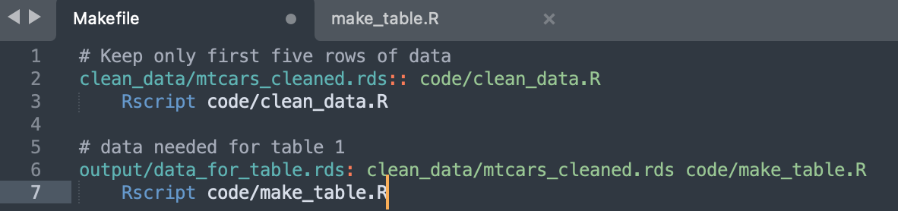
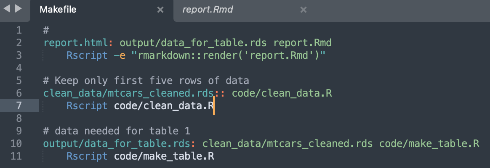
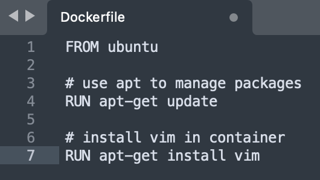
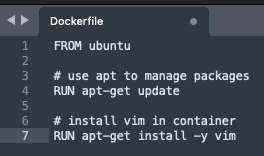

This is part 1 of my notes on _Docker for reproducible research_ from [Data Science Toolkit](https://benkeser.github.io/info550/), by David Benkeser.

[Video](https://benkeser.github.io/info550/recordings/docker-for-reproducible-research) | [Notes](https://benkeser.github.io/info550/lectures/11_docker/docker.html#1) | [Github](https://github.com/benkeser/info550/tree/master/lectures/11_docker)

# Part 1 (0:00 - 32:50)

## Pre-lecture Question

Q: Can we review project organization?

###  Phony data analysis 

1. $\underline{\text{Create and Open Project then Create Folders}}$ 

In the terminal: 

* mkdir example_project_2 $\quad\quad\quad\text{: make  directory }$

* subl example_project_2 $\quad\quad\quad\quad\text{: open in sublime }$

Then in a terminal in sublime create some folders: 

* mkdir code $\quad\quad\quad\quad\quad\quad\quad\text{: make  directory }$

* mkdir raw data $\quad\quad\quad\quad\quad\quad\text{: make directory }$

* mkdir clean data $\quad\quad\quad\quad\quad\quad\text{: make  directory }$

* mkdir output $\quad\quad\quad\quad\quad\quad\quad\text{: make  directory }$

2. $\underline{\text{Save Raw Data}}$ 

In the terminal: 

* R $\quad\quad\quad\quad\quad\quad\quad\quad\quad\quad\quad\text{: open R }$

* data(mtcars) $\quad\quad\quad\quad\quad\quad\quad\text{: load mtcars data set }$

* head(mtcars) $\quad\quad\quad\quad\quad\quad\quad\text{: show head of mtcars }$

* getwd() $\quad\quad\quad\quad\quad\quad\quad\quad\quad\text{: get working directory }$

* saveRDS(mtcars, "raw_data/mtcars.rds") $\quad\text{: save as .rds file}$

* saveRDS(mtcars, "raw_data/mtcars.RData") $\quad\text{: save as .RData file}$

* q() $\quad\quad\quad\quad\quad\quad\quad\quad\quad\quad\quad\text{: quit R }$

* y $\quad\quad\quad\quad\quad\quad\quad\quad\quad\quad\quad\text{: agree to quit }$

* rm raw_data/mtcars.RData $\quad\quad\text{: remove data from folder}$

Note that `.Rds` is preferred. 

3. $\underline{\text{Create Clean Data File}}$

[command] [N] : to create a new file. 

Then save that file in the code directory as "clean_data.R" with the following code: 

Note the 3 different places the here package is used. 

4. $\underline{\text{Create Makefile}}$

[command] [N] : to create a new file. 

Then save that file in the project directory as "Makefile" with the following code:

In the terminal: 

* make clean_data/mtcars_cleaned.rds

* Rscript code/clean_data.R 

Verify data is in clean_data folder 

5. $\underline{\text{Create make table file}}$

[command] [N] : to create a new file. 

Then save that file in the code folder as "make_table.R" with the following code:

6. $\underline{\text{Update Makefile}}$

Now update the Makefile with the following: 

In the terminal: 

* make output/data_for_table.rds

Verify contents in output folder. 

7. $\underline{\text{Create report.Rmd}}$

[command] [N] : to create a new file. 

Then save that file in the project directory as "report.Rmd" with the following code:

8. $\underline{\text{Update Makefile}}$ 

Update the Makefile with the following: 

In the terminal: 

* make report.html

* open report.html

## Pre-lecture Question (2)

Q: why doesn't git / github recognize empty folders? 

A: git doesn't care about empty folders in directory. 

### Make Github aware of empty folder

In terminal 

* rm output/* $\quad\quad\quad\quad\text{: remove everything in output folder}$

* gitinit $\quad\quad\quad\quad\quad\quad\text{: initilize git}$

* git status $\quad\quad\quad\quad\quad\text{: status}$

Notice the output folder isn't included. 

* cd output $\quad\quad\quad\quad\quad\text{: change to output directory}$

* touch .gitkeep $\quad\quad\quad\text{: add empty file}$

* ls -a  $\quad\quad\quad\quad\quad\quad\text{: list all files}$

* cd ..  $\quad\quad\quad\quad\quad\quad\text{: change directory up one level}$

* gitstatus $\quad\quad\quad\quad\quad\text{: status}$

Now the output folder is visible. 

# Part 2: Docker (33:00 - 1:16:50)

The problem: there are things on your computer that have nothing to do with R that R depends on. R wont help you track those dependencies. Renv only helps make sure R packages are up to date. 

You can download R code from github, but that doesn't mean you can run it. 

### Key Principle: Software is Code!

* running code requires software

* we want a way to package up all analysis and code AND software 

Containerization gives us a way to do this. 

* Docker is a popular containerization program 

Think of a Docker container as a virtual machine:

* Hos its own (Unix) operating system

* Has its own file system 

* Has its own software application 

(A computer within a computer)

### Images Vs. Containers

Docker image: 

* source code, libraries, dependencies, tools, and other files needed to run a container. 

* a blueprint for the enviroment in which you will execute your analysis 

Docker container: 

* created when we run an image

* contruct a run-time enviroment to execute your code

* or provide an interactive way to excecute code. 

### How does it work? 

* Docker installed program. 

* Write a Dockerfile, plain text that tells Docker what to put in image. 

* build the image

* run the image (creating container) to execute code. 

## Interactive Ubuntu container 

In the terminal: 

* docker pull ubuntu $\quad\quad\quad\text{: this is downloading an image from the internet}$

This is installing an empty ubuntu operating system.

If you have issues with this step check out this stack overflow link [here](https://stackoverflow.com/questions/52698748/connection-refused-on-pushing-a-docker-image) or [here](https://stackoverflow.com/questions/2333400/what-can-be-the-reasons-of-connection-refused-errors).

* docker run -it ubuntu /bin/bash $\quad\text{: puts you inside interactive (-it) ubuntu operating system}$

In a different terminal on your computer: 

* docker container ps $\quad\text{: prints all the containers you have running}$

Back inside docker terminal: 

* touch my_file_in_my_container $\quad\quad\text{: add file to container}$

* exit $\quad\quad\quad\quad\quad\quad\quad\quad\quad\text{: container stops running}$

* docker container ps $\quad\quad\quad\quad\text{: see the docker container no longer exists}$

* docker run -it ubuntu /bin/bash $\quad\quad\text{: start a docker container}$

Notice this is a different container, and the file that was created no longer exists. 

**Containers are transient!**

* exit $\quad\quad\quad\quad\quad\quad\quad\quad\quad\text{: exit container}$

### Adding a text editor to a docker file

In the terminal: 

* mkdir docker_ex $\quad\quad \text{: created docker_ex directory}$

* subl docker_ex $\quad\quad\text{: open in sublime}$

[command] [s] : save file as "Dockerfile"

* **FROM** : gives a starting point at the ubuntu operating system. 

* apt-get: is a package management system in ubuntu 

* update: make sure apt-get is up to date

* install vim: installs the text editor vim 

* **Run**: Docker syntax that tells it to run those two commands from the ubuntu operating system. 

Now back in the terminal: 

* cd docker_example/

* ls 

* docker build -t ubuntu_plus_vim . $\quad\quad\text{build docker file from current directory (thats what "." means)}$

Docker is angery because we aren't inside the container to hit yes. 

Fix: add "-y" to code (line 7) that says yes: 

Now that it works lets run it.

* docker run -it ubuntu_plus_vim /bin/bash $\quad\quad\text{: open up ubunto with vim that we just created}$

* vim $\quad\quad\text{opens text editor for editing}$

* :q $\quad\quad\quad\text{to quit vim}$

If you need to put a special piece of software inside a container you would google "how to install ____ on ubuntu", because that is being installed. 

## Dockerfile 

### COPY Example 

create a new hello world file. 

Now add the following line to your dockerfile: 

COPY hello_world.txt home/hello_wolrd.txt

In the sublime terminal: 

* docker build -t ubuntu_plus_vim_plus_helloworld .

* docker run -it ubuntu_plus_vim_plus_helloworld 

* ls

* cd home 

* ls
 
 * cat hello_world.txt 
 
 * exit 
 
 This will be useful so that we can copy our code into the container. 
 
 ### WORKDIR 
 
 Sets the working directory for all of your commands.
 
 Reason: We don't always know what the directories are within docker (like home in the previous example), so we want docker to the directory where our project lives. 
 
 Update Dockerfile with the following: 
 
 
 
 In the terminal: 
 
 * docker build -t try_workdir .
 
 * docker run -it try_workdir /bin/bash 
 
 Notice that we start out in the analysis_directory, and inside the directory is hello_world.txt. 
 
 * exit 
 
 ### CMD
 
 Continers entry point: what is the container going to do by defualt? 
 
Use cases:

* interactively run bash: CMD /bin/bash
    
* open R: CMD ["R"]

* run whole analysis and produce report: CMD Rscript -e "rmarkdown::render(...)"

# Part 3 (1:16:52 - )