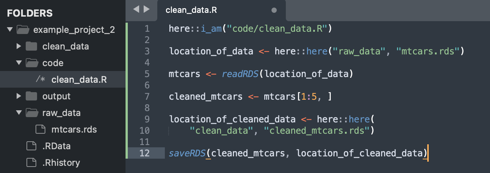

This is part 1 of my notes on _Docker for reproducible research_ from [Data Science Toolkit](https://benkeser.github.io/info550/), by David Benkeser.

[Video](https://benkeser.github.io/info550/recordings/docker-for-reproducible-research) | [Notes](https://benkeser.github.io/info550/lectures/11_docker/docker.html#1) | [Github](https://github.com/benkeser/info550/tree/master/lectures/11_docker)

# Part 1 (0:00 - 32:50)

## Pre-lecture Question

Q: Can we review project organization?

###  Phony data analysis 

1. $\underline{\text{Create and Open Project then Create Folders}}$ 

In the terminal: 

* mkdir example_project_2 $\quad\quad\quad\text{: make  directory }$

* subl example_project_2 $\quad\quad\quad\quad\text{: open in sublime }$

Then in a terminal in sublime create some folders: 

* mkdir code $\quad\quad\quad\quad\quad\quad\quad\text{: make  directory }$

* mkdir raw data $\quad\quad\quad\quad\quad\quad\text{: make directory }$

* mkdir clean data $\quad\quad\quad\quad\quad\quad\text{: make  directory }$

* mkdir output $\quad\quad\quad\quad\quad\quad\quad\text{: make  directory }$

2. $\underline{\text{Save Raw Data}}$ 

In the terminal: 

* R $\quad\quad\quad\quad\quad\quad\quad\quad\quad\quad\quad\text{: open R }$

* data(mtcars) $\quad\quad\quad\quad\quad\quad\quad\text{: load mtcars data set }$

* head(mtcars) $\quad\quad\quad\quad\quad\quad\quad\text{: show head of mtcars }$

* getwd() $\quad\quad\quad\quad\quad\quad\quad\quad\quad\text{: get working directory }$

* saveRDS(mtcars, "raw_data/mtcars.rds") $\quad\text{: save as .rds file}$

* saveRDS(mtcars, "raw_data/mtcars.RData") $\quad\text{: save as .RData file}$

* q() $\quad\quad\quad\quad\quad\quad\quad\quad\quad\quad\quad\text{: quit R }$

* y $\quad\quad\quad\quad\quad\quad\quad\quad\quad\quad\quad\text{: agree to quit }$

* rm raw_data/mtcars.RData $\quad\quad\text{: remove data from folder}$

Note that `.Rds` is preferred. 

3. $\underline{\text{Create Clean Data File}}$

[command] [N] : to create a new file. 

Then save that file in the code directory as "clean_data.R" with the following code: 

Note the 3 different places the here package is used. 

4. $\underline{\text{Create Makefile}}$

[command] [N] : to create a new file. 

Then save that file in the project directory as "Makefile" with the following code:

In the terminal: 

* make clean_data/mtcars_cleaned.rds

* Rscript code/clean_data.R 

Verify data is in clean_data folder 

5. $\underline{\text{Create make_table.R}}$

[command] [N] : to create a new file. 

Then save that file in the code folder as "make_table.R" with the following code:

6. $\underline{\text{Update Makefile}}$

Now update the Makefile with the following: 

In the terminal: 

* make output/data_for_table.rds

Verify contents in output folder. 

7. $\underline{\text{Create report.Rmd}}$

[command] [N] : to create a new file. 

Then save that file in the project directory as "report.Rmd" with the following code:

8. $\underline{\text{Update Makefile}}$ 

Update the Makefile with the following: 

In the terminal: 

* make report.html

* open report.html

## Pre-lecture Question (2)

Q: why doesn't git / github recognize empty folders? 

A: git doesn't care about empty folders in directory. 

### Make Github aware of empty folder

In terminal 

* rm output/* $\quad\quad\quad\quad\text{: remove everything in output folder}$

* gitinit $\quad\quad\quad\quad\quad\quad\text{: initilize git}$

* git status $\quad\quad\quad\quad\quad\text{: status}$

Notice the output folder isn't included. 

* cd output $\quad\quad\quad\quad\quad\text{: change to output directory}$

* touch .gitkeep $\quad\quad\quad\text{: add empty file}$

* ls -a  $\quad\quad\quad\quad\quad\quad\text{: list all files}$

* cd ..  $\quad\quad\quad\quad\quad\quad\text{: change directory up one level}$

* gitstatus $\quad\quad\quad\quad\quad\text{: status}$

Now the output folder is visible. 

# Part 2 (33:00 - XX:XX)

Coming Soon ... 
